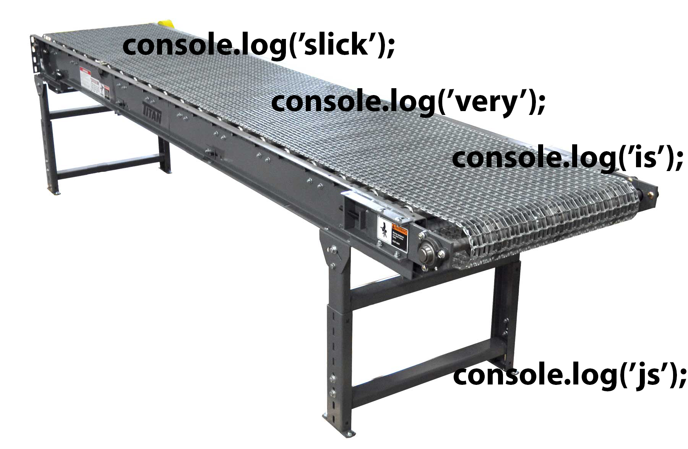

## I was stuck

I would show a coworker some js code I had written and he would scoff and say

> Why aren't you using this??

I didn't even know what ES6 was

No clue

## So I

Bought [this book](https://www.amazon.com/Understanding-ECMAScript-Definitive-JavaScript-Developers/dp/1593277571) by Nicholas Zakas

It was great

I am now a cool coder

Keep reading to join me

### Const > Let > Var (almost never var)

Use const unless you absolutely need to reassign the object([immutability](https://en.wikipedia.org/wiki/Immutable_object) reduces bugs) in which case use let, but now that we have ES6 using var is basically unacceptable.

### Use `...` to expand arrays

This applies to arrays you would like to copy or with functions as a way to accept an undefined number of optional parameters.

Copying an array

```js
const countries = ['France', 'US', 'Canada']
const [...clonedCountries] = countries
```

Using optional parameters in functions

```js
function crazyEquation(operand, divisor, ...rest) {
  const sum = rest.reduce((previous, current) => previous + current, 0)
  return operand / divisor + sum
}
```

### Arrow functions

Look way cleaner and provide much more expected behavior than what we used to have.

```js
Let echo = function(value) {
  return value
}
```

Can be

```js
let echo = (value) => value
```

This works because if only one value is shown after the `=>` it assumes that you want to return that.

### Destructuring

With this object

```js
let object = {
  name: ‘blah’,
  age: 25,
}
```

We can now do this

```js
const { name, age } = object
```

Instead of having to do this

```js
const name = object.name
const age = object.age
```

If you need to reassign it works like this

```js
let name
let age
;({ name, age } = object)
```

You can also rename them like this

```js
{ name:localName, age: localAge } = object;
```

This also works with arrays, but it obviously just goes off indices

```js
const [first, second, third] = array
```

### Asynchronicity

Use Promises they will make your life way better. We can turn this

```js
getCountry(function(err, country) {
  getState(country, function(err, state) {
    getCity(state, function(err, city) {
      getNeighborhood(city, function(err, neighborhood) {
        getAddress(neighborhood, function(err, address) {
          reportAddress(address, function(e) {
            ...
          });
        });
      });
    });
  });
});
```

Into this

```js
getCountry()
  .then(getState)
  .then(getCity)
  .then(getNeighborhood)
  .then(getAddress)
  .then(reportAddress)
  .then(function(success) {
    console.log(success)
  })
  .catch(function(e) {
    console.error(e)
  })
```

Which is just so much less to write and much cleaner. With ES8, which isn't in the book, but is now broadly supported we can even do this with awaits.

```js
try {
  const country = await getCountry()
  const state = await getState(country)
  const city = await getCity(state)
  const neighborhood = await getNeighborhood(city)
  const address = await getAddress(neighborhood)
  const reportStatus = await reportAddress(address)
  console.log(reportStatus)
} catch (err) {
  console.error(err)
}
```

### Broader takeaway

Javascript is completely synchronous and asynchronous behavior only exists because of how we use it. The JS engine is basically a conveyor belt. It just runs jobs in a FIFO queue so all the other wild behavior we can get out of it is completely our doing. The key to understanding asynchronous behavior is just a matter of understanding what lines of code are returning right away and which are returning promises or are expecting callbacks to be passed into them.

