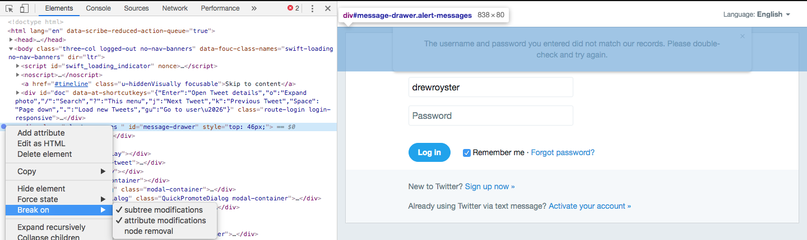

## I was stuck

I was asked to test a login page and report any errors that occur

And there were errors with very specific error messages e.g. `e.g923ngsflsjd`

BUT I couldn't snag the message before it timed out

## So I

Discovered this great feature

This is how we tell Chrome "Don't change anything on this div or anything below it when a potential change occurs UNTIL I say so"

It's been a lifesaver for me and could be for you as well
